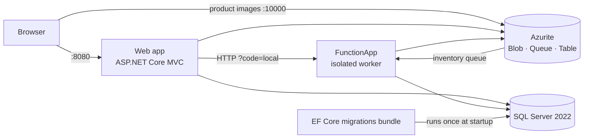

# ABC Retail – Azure E-Commerce Platform (offline branch)

ASP.NET Core 8 MVC storefront and admin portal backed by Azure Functions, Azure Storage
(Tables, Blobs, Queues, Files) and Azure SQL.

> **This is the `feature/azurite-offline` branch.** It runs the whole platform locally in
> Docker with **no Azure subscription and no internet** (after the first build), using
> [Azurite](https://github.com/Azure/Azurite) in place of Azure Storage and SQL Server 2022
> in place of Azure SQL. **The application code is identical to `main`** – only
> configuration, Docker files and this README are added.

## Quick start

**Prerequisite:** [Docker Desktop](https://www.docker.com/products/docker-desktop/) running.

```powershell
.\start-offline.ps1        # or double-click start-offline.cmd
```

The script builds the images, starts every service, waits until the site responds and opens
<http://localhost:8080>. Sign in with the seeded admin account defined in
[`Program.cs`](ST10382638_CLDV_POE/Program.cs), or register a customer account.

The first run needs internet once (~3.5 GB of base images and NuGet packages). After that it
runs fully offline.

| Task | Command |
|---|---|
| Stop (keep data) | `docker compose down` |
| Stop and wipe all data | `docker compose down -v` |
| Follow logs | `docker compose logs -f web functions` |
| Rebuild after code changes | `.\start-offline.ps1` |

## Architecture



| Service | Port | Purpose |
|---|---|---|
| `web` | 8080 | MVC site (`ASPNETCORE_ENVIRONMENT=Development`) |
| `functions` | 7135 | `TableWrite`, `BlobWrite`, `FileWrite`, `QueueFunction`, `OrderQueueTrigger` |
| `azurite` | 10000–10002 | Blob, Queue and Table storage emulator |
| `sql` | 1433 | SQL Server 2022 Developer edition |
| `migrate` | – | Applies EF Core migrations, then exits |

All services share one network namespace, so `127.0.0.1` means the same thing inside every
container and on the host. That is what lets blob URLs generated inside the containers
(`http://127.0.0.1:10000/devstoreaccount1/...`) load in your browser without code changes.

## Differences from Azure (`main`)

| Feature | Azure | This branch |
|---|---|---|
| Tables, blobs, queues | Azure Storage | Azurite 3.37 |
| Relational data | Azure SQL | SQL Server 2022 container |
| Function auth | Per-function keys | Fixed local key `local` |
| Application Insights | Enabled | Not configured (telemetry is dropped) |
| **Contracts (Azure Files)** | Azure File Share | **Not available** – see below |
| Bootstrap Icons | CDN | CDN – icons don't show when offline |

### Why contracts don't work offline

Azurite emulates Blob, Queue and Table storage only. There is no Azure Files emulator
([Azurite #113](https://github.com/Azure/Azurite/issues/113), open since 2018). The Azure
SDK itself rejects the emulator for file shares:

```
System.ArgumentException: Connection string for emulator is not valid for Azure File Shares
```

Because `ContractService` is only created when the Contracts page is opened, every other
feature keeps working. Use `main` against a real storage account to demo contracts.

## Configuration

Nothing here is a secret. Every value is a public emulator default or local-only:

- [`ST10382638_CLDV_POE/appsettings.Development.json`](ST10382638_CLDV_POE/appsettings.Development.json):
  `UseDevelopmentStorage=true`, local SQL and Function URLs. Committed on this branch only (see `.gitignore`).
- [`compose.yaml`](compose.yaml): service wiring, the SQL `sa` password for the local container
  and Function settings.
- [`Dockerfile`](Dockerfile): one build stage and three runtime targets (`web`, `migrate`, `functions`).

Running `compose.yaml` accepts the
[SQL Server Developer edition licence](https://go.microsoft.com/fwlink/?linkid=857698)
(`ACCEPT_EULA=Y`), which is free for development and testing.

## Troubleshooting

| Symptom | Fix |
|---|---|
| `port is already allocated` | Stop anything else on 10000–10002, 1433, 7135 or 8080. A locally installed Azurite is the usual cause. |
| Script says the site did not come up | It prints the `migrate`, `functions` and `web` logs. Re-run once in case SQL Server started slowly. |
| Contracts page shows an error | Expected offline. See [Why contracts don't work offline](#why-contracts-dont-work-offline). |
| Need a clean demo | `docker compose down -v`, then `.\start-offline.ps1` |
